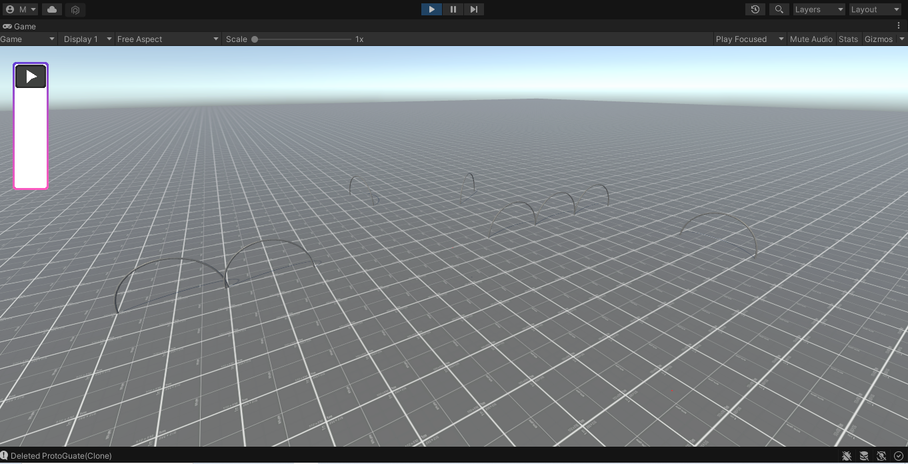

# DRP_Editor
DRP_Editor is a brand new fpv track editor from France to save all the placement of the guates, flags, stairs, cube of the races or the trainings. It is free and coded by mattoon and viofly, both french, with unity. The main goal of this project is to help fpv clubs like ours (Drone Racing Polienas) to organize events.  

This is the first update of the project, you can place guates, selection them but cannot make something with the selection, and you can delete them !